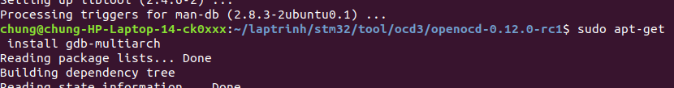

# stm32f103cxt6

## Problems with USB to UART PL2303

- Config putty to receive and transmitt data 
> Setting default will not receive and transmitt data to PL2303


- Let setting below:


- **Set Flow control : None**
- Parity : None
- Test result


# Quá trình cài đặt tool biên dịch và nạp chương trình cho stm32f103c8t6

## 1. Cài đặt arm-none-eabi-gcc trình biên dịch cho arm
- Dowload tool 

>gcc-arm-none-eabi-10.3-2021.10-x86_64-linux.tar.bz2

- Giai nen file tren va vao duong dan gcc-arm/bin/ sau do chay lenh sau de kiem tra phien ban:

>./arm-none-eabi-gcc -v


- Duong dan trong makefile :

> PREFIX = /home/chung/laptrinh/stm32/tool/gcc-arm/bin/arm-none-eabi-

# 2. Cai dat st-flash de nap chuong trinh cho stm32
- Trang web: https://github.com/stlink-org/stlink/releases
- Vi dang dung ban Ubuntu 18.04 nen khong the tai cac ban moi nhat tren trang github ma can chon ban phu hop. O day chon ban 1.5.0


- Sau do giai nen file bang lenh 

>unzip stlink-1.5.0.zip -d [thumucdich]

- Vao thu muc vua giai nen, sau do doc qua file compiling.md de biet cach cai dat.

> nano stlink-1.5.0/doc/compiling.md 

- Trong file co ghi chu ve viec cai cac thu vien can thiet va fix lai mot loi khi bien dich

```
# Compiling
## Build from sources
* CMake (minimal v2.8.7)
* C compiler (gcc, clang, mingw)
* Libusb 1.0 (minimal v1.0.9)
* (optional) pandoc for generating manpages from markdown
...
## Linux
## Common requirements
* Debian based distros (debian, ubuntu)
  * `build-essential`
* `cmake`
* `libusb-1.0` (plus development headers for building, on debian based distros $
* (optional) for `stlink-gui` we need libgtk-3-dev

### Fixing cannot open shared object file

When installing system-wide (`sudo make install`) the dynamic library cache needs to be updated with the command `ldconfig`.
```

- Thu vien can thiet :libusb-1.0 
- Truoc khi chay lenh sudo make can chay lenh sudo ldconfig truoc de khong bi loi thu vien : 
> error while loading shared libraries: libstlink-shared.so.1

- sau khi chay lenh sudo make, vao thu muc build se duoc cac file sau:

```
$laptrinh/stm32/tool/stlink-1.5.0/build/Release$ ls
CMakeCache.txt           include                    src
CMakeFiles               libstlink.a                st-flash
cmake_install.cmake      libstlink-shared.so        st-info
CPackConfig.cmake        libstlink-shared.so.1      tests
CPackSourceConfig.cmake  libstlink-shared.so.1.5.0  usr
doc                      Makefile
```
- luc nay da co the chay lenh ./st-flash va ./st-info de kiem tra

```
$/aptrinh/stm32/tool/stlink-1.5.0/build/Release$ ./st-info --version
v1.5.0

$laptrinh/stm32/tool/stlink-1.5.0/build/Release$ ./st-flash
invalid command line
stlinkv1 command line: ./st-flash [--debug] [--reset] [--format <format>] [--flash=<fsize>] {read|write} /dev/sgX <path> <addr> <size>
stlinkv1 command line: ./st-flash [--debug] /dev/sgX erase
stlinkv2 command line: ./st-flash [--debug] [--reset] [--serial <serial>] [--format <format>] [--flash=<fsize>] {read|write} <path> <addr> <size>
stlinkv2 command line: ./st-flash [--debug] [--serial <serial>] erase
stlinkv2 command line: ./st-flash [--debug] [--serial <serial>] reset
                       Use hex format for addr, <serial> and <size>.
                       fsize: Use decimal, octal or hex by prefix 0xXXX for hex, optionally followed by k=KB, or m=MB (eg. --flash=128k)
                       Format may be 'binary' (default) or 'ihex', although <addr> must be specified for binary format only.
                       ./st-flash [--version]
```

- Sau do copy 2 file chay st-flash va st-info cao thu muc /usr/bin

> sudo cp st-flash /usr/bin
> sudo cp st-info /usr/bin

## Qua trinh debug chuong trinh dung openOCD tren stm32f103c8t6

- cai dat gdb-multiarch



- cai dat libtool


- cai dat openOCD


## Link tham khao:
>   https://tapit.vn/chuc-nang-lowpower-mode-cua-mcu-stm32f103c8t6/ 
>   https://tapit.vn/real-time-clock-rtc-tren-stm32f103c8t6/

>   https://hocarm.org/gioi-thieu-mot-so-he-dieu-hanh-thoi-gian-thuc/
>   https://hocarm.org/tag/stm32/page/4/
>   https://hocarm.org/su-dung-swo-de-debug-thong-tin-tu-stm32/
>   https://hocarm.org/rtos-software-timer/
>   https://hocarm.org/rtos-co-ban-phan-1/

>   https://iot47.com/nhung-va-phat-am-thanh-tren-stm32-voi-dma-va-pwm/
>   https://iot47.com/nhung-va-phat-am-thanh-tren-stm32-voi-dma-va-pwm/

>   https://laptrinharmst.blogspot.com/2018/02/bai-00-gioi-thieu-ve-stm32f103c8$
>   https://laptrinharmst.blogspot.com/2018/04/bai-13-rtc-voi-stm32f103.html

>   https://elec2pcb.com/2023/12/12/stm32_hal_cubemx_gnu_make_pyocd/?fbclid=IwA$

>   https://solutionias.com/giao-tiep-can-la-gi-cau-truc-va-ung-dung/#:~:text=C$

### mpu6050 library:
>   https://stm32f4-discovery.net/download/tm_stm32f4_mpu6050/

### The STM32G030
>   https://ioprog.com/2020/05/03/the-stm32g030/

